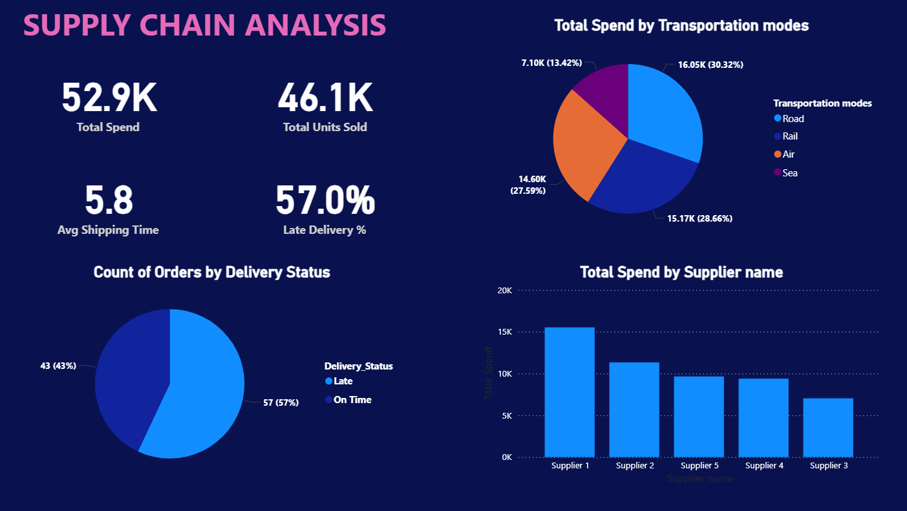
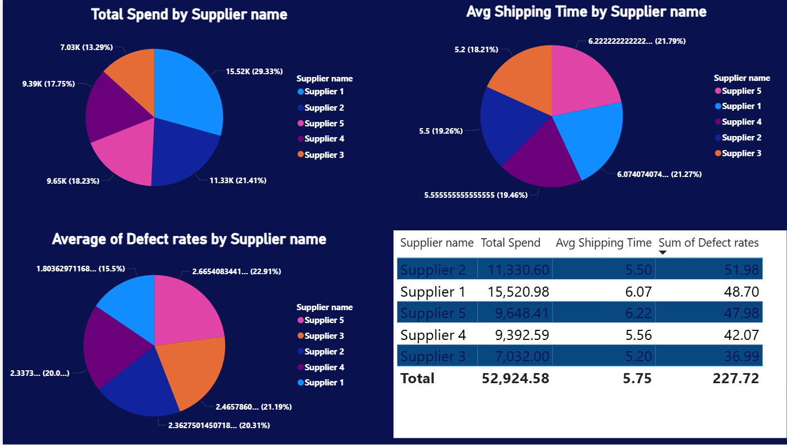
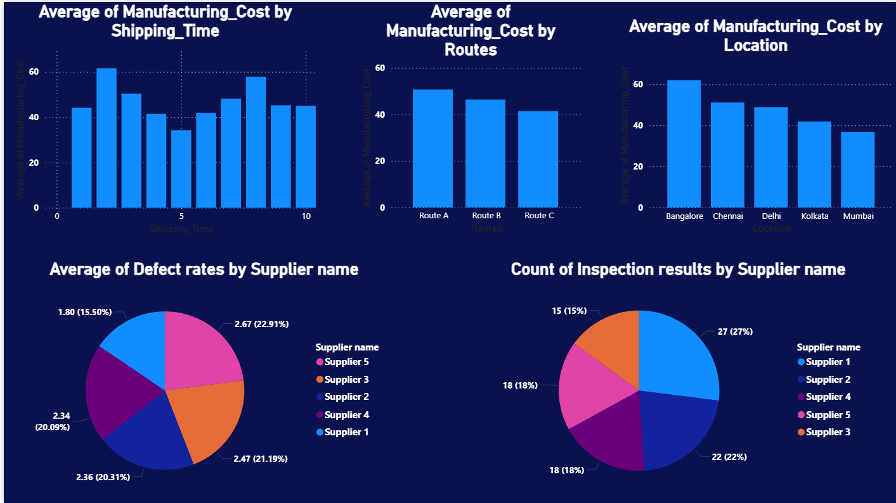

# Procurement Analytics Dashboard
## Problem Statement
Organizations often struggle to monitor procurement efficiency, supplier performance, and cost distribution. 
This project analyzes supply chain data to identify inefficiencies, high-cost areas, and supplier risks.
## Tools Used
- Power BI
- Excel (Data Cleaning)
- Power Query
- DAX
## Key KPIs
- Total Procurement Cost
- Average Shipping Time
- Supplier Lead Time
- Late Delivery Percentage
- Defect Rate
## Dashboard Features
- Supplier performance analysis
- Cost distribution by transportation mode
- Delivery delay tracking
- Quality and defect analysis
- Interactive filters and drill-down insights
## Key Insights
- Supplier 3 contributes the highest procurement cost
- Air transportation increases cost but reduces delivery time
- Certain suppliers show high defect rates indicating quality risks
- Route B has higher delivery delays compared to Route A
## Dashboard Preview

